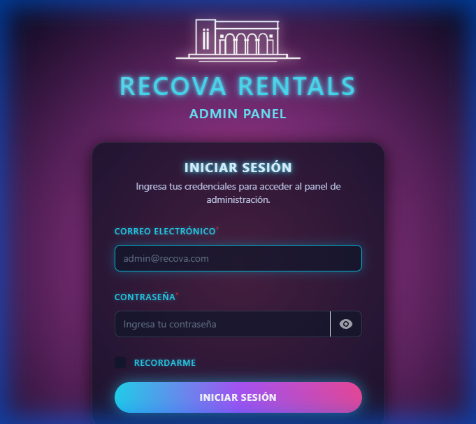
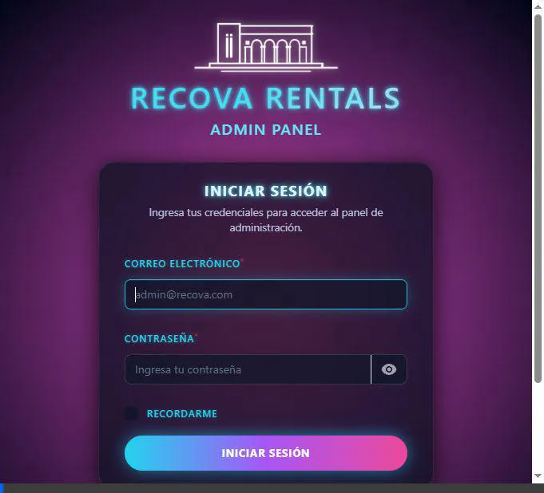
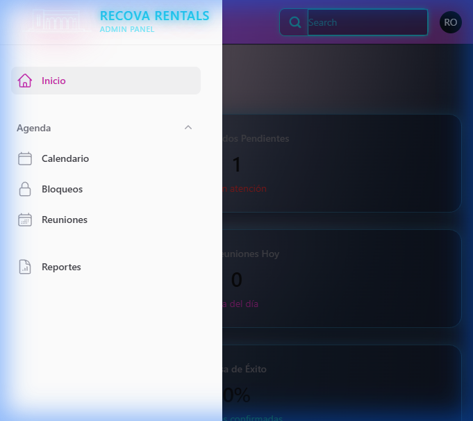
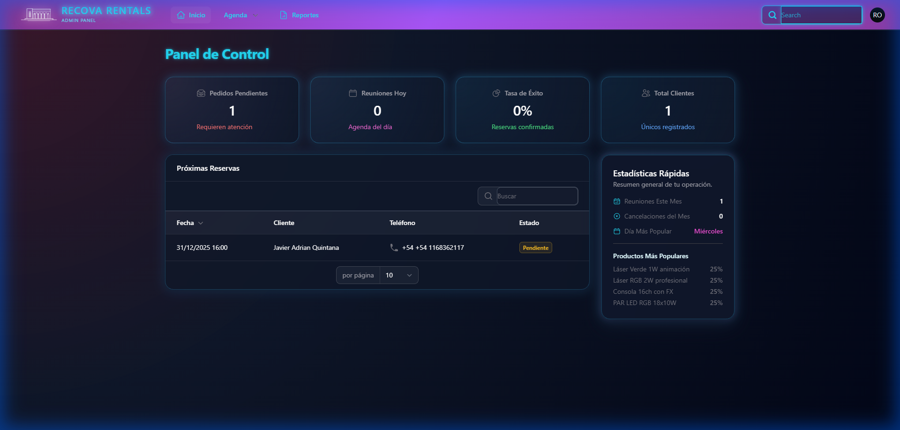
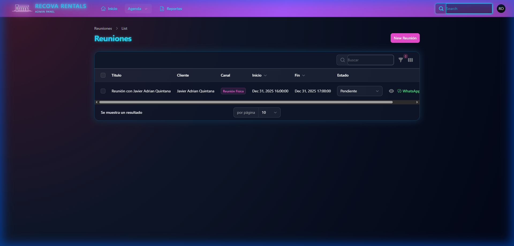
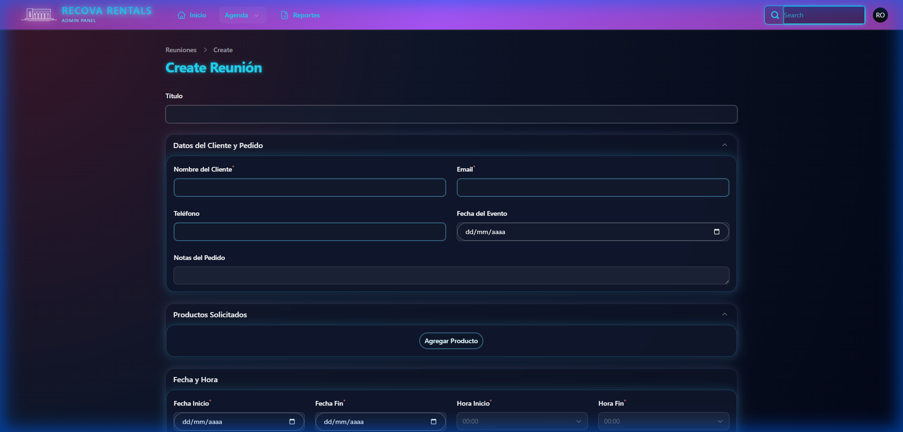
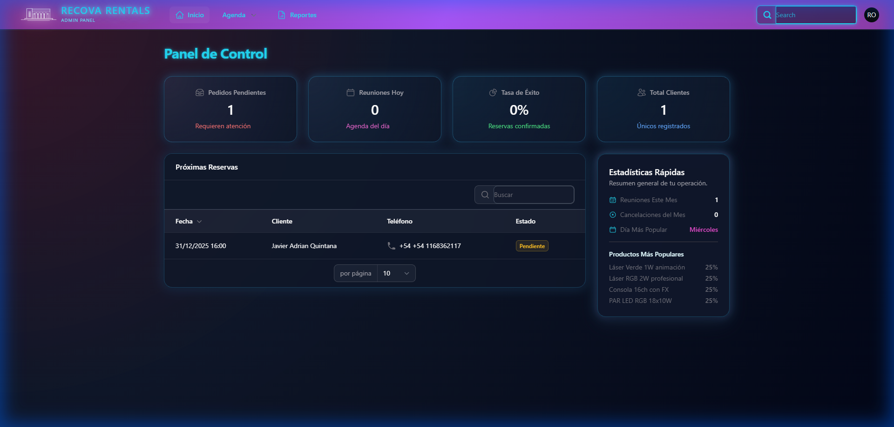
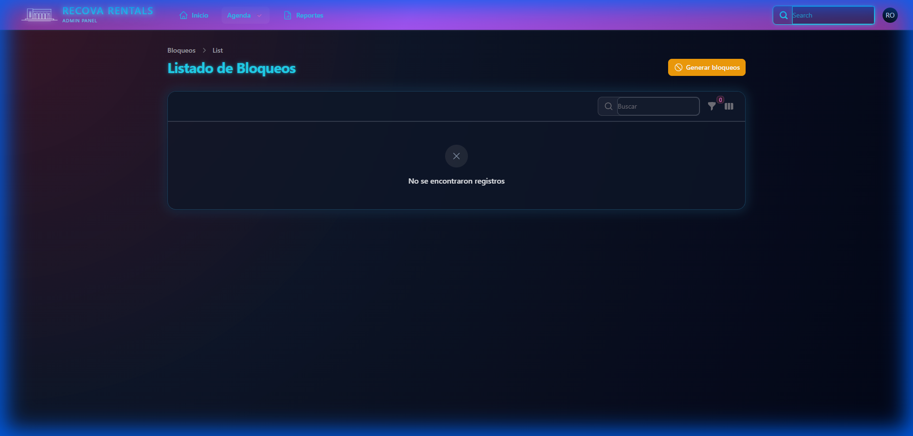
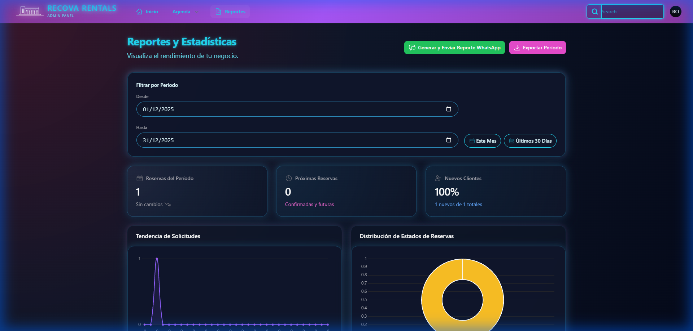

# Manual de Usuario - Recova Rentals Admin Panel

**Versión:** 1.0  
**Fecha:** Diciembre 2025  
**Sistema:** Panel de Administración Recova Rentals

---

## Tabla de Contenidos

1. [Introducción](#introducción)
2. [Acceso al Sistema](#acceso-al-sistema)
3. [Panel de Control (Dashboard)](#panel-de-control-dashboard)
4. [Gestión de Reuniones](#gestión-de-reuniones)
5. [Bloqueos de Calendario](#bloqueos-de-calendario)
6. [Generación de Reportes](#generación-de-reportes)
7. [Sincronización con Google Calendar](#sincronización-con-google-calendar)
8. [Solución de Problemas](#solución-de-problemas)

---

## Introducción

Bienvenido al **Panel de Administración de Recova Rentals**, una plataforma completa diseñada para gestionar reuniones con clientes potenciales, coordinar agendas y generar reportes de actividad.

### Características Principales

- ✅ **Autenticación segura** con email/contraseña y Google OAuth
- 📅 **Gestión de reuniones** con clientes
- 🚫 **Bloqueos de calendario** para controlar disponibilidad
- 📊 **Reportes detallados** de actividad
- 🔄 **Sincronización** con Google Calendar
- 🎨 **Interfaz moderna** y responsive

---

## Acceso al Sistema

### Inicio de Sesión

Para acceder al panel de administración, siga estos pasos:

1. **Navegue a la URL del sistema:**
   ```
   http://127.0.0.1:8000/admin/login
   ```

2. **Visualizará la pantalla de login:**



### Opciones de Autenticación

#### Opción 1: Login con Email y Contraseña

1. Ingrese su **correo electrónico** en el campo "Correo Electrónico"
2. Ingrese su **contraseña** en el campo "Contraseña"
3. (Opcional) Marque la casilla "Recordar" para mantener la sesión activa
4. Haga clic en el botón **"Iniciar Sesión"**

> **📝 Credenciales de Ejemplo:**
> - Email: `recovarentals@gmail.com`
> - Contraseña: `admin123`

#### Opción 2: Login con Google OAuth

1. Haga clic en el botón **"Google"** ubicado debajo del formulario
2. Será redirigido a la página de autenticación de Google
3. Seleccione su cuenta de Google
4. Autorice el acceso a la aplicación
5. Será redirigido automáticamente al panel de control



---

## Panel de Control (Dashboard)

Una vez autenticado, accederá al **Dashboard** principal:



### Elementos del Dashboard

#### Barra de Navegación Superior

- **Inicio:** Volver al dashboard principal
- **Agenda:** Acceso a Reuniones y Bloqueos de Calendario
- **Reportes:** Generación de informes
- **Perfil de Usuario:** Configuración de cuenta (esquina superior derecha)

#### Widgets y Estadísticas

El dashboard muestra información resumida sobre:

- 📊 **Total de reuniones** programadas
- ✅ **Reuniones completadas**
- ⏳ **Reuniones pendientes**
- 📈 **Tendencias** de actividad



---

## Gestión de Reuniones

La sección de **Reuniones** permite administrar todas las citas con clientes potenciales.

### Acceder a Reuniones

1. Haga clic en **"Agenda"** en la barra superior
2. Seleccione **"Reuniones"** del menú desplegable



### Crear una Nueva Reunión

1. Haga clic en el botón **"New Reunión"** (esquina superior derecha)
2. Complete el formulario con la siguiente información:



#### Campos del Formulario

| Campo | Descripción | Requerido |
|-------|-------------|-----------|
| **Nombre del Cliente** | Nombre completo del cliente | ✅ Sí |
| **Email** | Correo electrónico de contacto | ✅ Sí |
| **Teléfono** | Número de teléfono | ✅ Sí |
| **Fecha Inicio** | Fecha de la reunión | ✅ Sí |
| **Hora Inicio** | Hora de inicio | ✅ Sí |
| **Hora Fin** | Hora de finalización | ✅ Sí |
| **Estado** | Estado de la reunión (Pendiente/Confirmada/Completada/Cancelada) | ✅ Sí |
| **Notas** | Observaciones adicionales | ❌ No |

#### Ejemplo de Datos

```
Nombre del Cliente: Juan Pérez
Email: juan.perez@example.com
Teléfono: +54 11 1234-5678
Fecha Inicio: 2025-12-04
Hora Inicio: 10:00
Hora Fin: 11:00
Estado: Pendiente
Notas: Interesado en alquilar departamento 2 ambientes
```

3. Haga clic en **"Create"** para guardar la reunión



### Gestionar Reuniones Existentes

En la lista de reuniones, puede:

- 👁️ **Ver detalles:** Haga clic en una fila para ver información completa
- ✏️ **Editar:** Modifique los datos de una reunión existente
- 🗑️ **Eliminar:** Borre reuniones canceladas o erróneas
- 🔍 **Buscar:** Use el campo de búsqueda para filtrar reuniones
- 📄 **Exportar:** Descargue la lista en formato CSV o PDF

### Estados de Reunión

| Estado | Descripción | Color |
|--------|-------------|-------|
| **Pendiente** | Reunión programada, esperando confirmación | 🟡 Amarillo |
| **Confirmada** | Cliente confirmó asistencia | 🔵 Azul |
| **Completada** | Reunión realizada exitosamente | 🟢 Verde |
| **Cancelada** | Reunión cancelada | 🔴 Rojo |

---

## Bloqueos de Calendario

Los **Bloqueos de Calendario** permiten marcar períodos de tiempo como no disponibles para reuniones.

### Acceder a Bloqueos

1. Haga clic en **"Agenda"** en la barra superior
2. Seleccione **"Bloqueos"** del menú desplegable



### Crear un Bloqueo

1. Haga clic en **"New Bloqueo"**
2. Complete los siguientes campos:
   - **Fecha Inicio:** Primera fecha del bloqueo
   - **Fecha Fin:** Última fecha del bloqueo
   - **Motivo:** Razón del bloqueo (vacaciones, mantenimiento, etc.)
   - **Todo el día:** Marque si el bloqueo es por día completo
   - **Hora Inicio/Fin:** Si no es todo el día, especifique horarios

3. Haga clic en **"Create"**

### Casos de Uso Comunes

- 🏖️ **Vacaciones:** Bloquear períodos de ausencia
- 🔧 **Mantenimiento:** Reservar tiempo para tareas administrativas
- 📅 **Eventos especiales:** Marcar días festivos o eventos corporativos
- ⏰ **Horarios no laborales:** Definir franjas horarias no disponibles

---

## Generación de Reportes

La sección de **Reportes** permite generar informes detallados sobre la actividad del sistema.

### Acceder a Reportes

1. Haga clic en **"Reportes"** en la barra superior



### Tipos de Reportes Disponibles

#### 1. Reporte de Reuniones

Muestra estadísticas detalladas sobre reuniones:

- Total de reuniones por período
- Distribución por estado
- Tasa de conversión
- Clientes más activos

#### 2. Reporte de Disponibilidad

Analiza la disponibilidad del calendario:

- Horas disponibles vs. ocupadas
- Bloqueos activos
- Tendencias de ocupación

#### 3. Reporte Personalizado

Permite crear reportes a medida con:

- **Rango de fechas:** Seleccione el período a analizar
- **Filtros:** Estado, cliente, tipo de reunión
- **Métricas:** Elija qué datos incluir
- **Formato:** PDF, Excel, CSV

### Generar un Reporte

1. Seleccione el **tipo de reporte**
2. Configure los **parámetros** (fechas, filtros)
3. Haga clic en **"Generar Reporte"**
4. El reporte se generará y podrá:
   - 👁️ Visualizarlo en pantalla
   - 💾 Descargarlo en el formato seleccionado
   - 📧 Enviarlo por email

---

## Sincronización con Google Calendar

El sistema se integra con **Google Calendar** para sincronizar automáticamente las reuniones.

### Configurar la Sincronización

> **⚠️ IMPORTANTE:** La sincronización con Google Calendar requiere configuración previa de credenciales OAuth en el archivo `.env`

#### Variables de Entorno Necesarias

```env
GOOGLE_CLIENT_ID=your-client-id
GOOGLE_CLIENT_SECRET=your-client-secret
GOOGLE_REDIRECT_URI=http://127.0.0.1:8000/auth/google/callback
```

### Cómo Funciona

1. **Autenticación:** Al iniciar sesión con Google OAuth, se solicitan permisos para acceder al calendario
2. **Sincronización Automática:** 
   - Cuando crea una reunión en Recova Rentals, se crea automáticamente en Google Calendar
   - Las actualizaciones se sincronizan en ambas direcciones
   - Las eliminaciones se reflejan en ambos sistemas

3. **Cola de Sincronización:** El sistema usa una cola de trabajos para procesar sincronizaciones en segundo plano

### Verificar Estado de Sincronización

- En la lista de reuniones, verá un ícono 🔄 indicando el estado de sincronización
- Estados posibles:
  - ✅ **Sincronizado:** Reunión actualizada en Google Calendar
  - ⏳ **Pendiente:** Sincronización en cola
  - ❌ **Error:** Problema de sincronización (revise logs)

---

## Solución de Problemas

### Problemas Comunes

#### No puedo iniciar sesión

**Síntomas:** Mensaje "Estas credenciales no coinciden con nuestros registros"

**Soluciones:**
1. Verifique que el email esté escrito correctamente
2. Asegúrese de usar la contraseña correcta
3. Use la opción "¿Olvidó su contraseña?" para resetearla
4. Intente iniciar sesión con Google OAuth como alternativa

#### Google OAuth no funciona

**Síntomas:** Error al hacer clic en el botón de Google

**Soluciones:**
1. Verifique que las credenciales OAuth estén configuradas en `.env`
2. Asegúrese de que la URL de redirección coincida con la configurada en Google Cloud Console
3. Revise que los permisos de Google Calendar estén habilitados

#### Las reuniones no se sincronizan con Google Calendar

**Síntomas:** Reuniones creadas no aparecen en Google Calendar

**Soluciones:**
1. Verifique que la cola de trabajos esté corriendo:
   ```bash
   php artisan queue:listen --queue=default,google-sync
   ```
2. Revise los logs en `storage/logs/laravel.log`
3. Verifique que el token de Google no haya expirado
4. Re-autentique con Google OAuth

#### El selector de fecha no funciona

**Síntomas:** Al hacer clic en el campo de fecha no se abre el calendario

**Soluciones:**
1. Intente escribir la fecha directamente en formato `YYYY-MM-DD`
2. Limpie la caché del navegador
3. Intente con otro navegador
4. Verifique que JavaScript esté habilitado

### Contacto de Soporte

Para asistencia adicional, contacte a:

- **Email:** recovarentals@gmail.com
- **Documentación:** Consulte el README.md del proyecto
- **Logs:** Revise `storage/logs/laravel.log` para errores detallados

---

## Apéndices

### Requisitos del Sistema

**Servidor:**
- PHP 8.3+
- Laravel 12.x
- MySQL 8.0+
- Composer
- Node.js 18+

**Cliente:**
- Navegador moderno (Chrome, Firefox, Safari, Edge)
- JavaScript habilitado
- Conexión a Internet

### Atajos de Teclado

| Atajo | Acción |
|-------|--------|
| `Ctrl + K` | Búsqueda global |
| `Ctrl + N` | Nueva reunión |
| `Esc` | Cerrar modal |

### Glosario

- **OAuth:** Protocolo de autenticación segura
- **Reunión:** Cita programada con un cliente
- **Bloqueo:** Período de tiempo marcado como no disponible
- **Sincronización:** Actualización automática entre sistemas
- **Dashboard:** Panel de control principal

---

## Historial de Versiones

| Versión | Fecha | Cambios |
|---------|-------|---------|
| 1.0 | Dic 2025 | Versión inicial del manual |

---

**© 2025 Recova Rentals. Todos los derechos reservados.**
